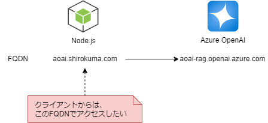

# モチベーション

ある事情から、クライアント環境からAzureOpenAIにアクセスする際に、AzureOpenAIのFQDNを使ってアクセスできず、特定のドメイン名でアクセスする必要がありました。
ApplicationGatewayなどで対応することもできたかもしれませんが、暫定的な対応として、Node.jsでプロキシーサーバを実装してみました。



# プロキシサーバの実装

## 実装コード

コード全体の流れ
1. HTTPサーバーを作成してリクエストを受信。
2. 受け取ったリクエストをパースして転送先を設定。
3. 転送先のホストにリクエストを転送。
4. 転送先からのレスポンスを受け取り、元のクライアントに返す。
5. エラーハンドリング。

### プロキシサーバのNodejsのコードはこちらです。
https://github.com/nomhiro/nodejs_proxy_openai/blob/main/proxy/proxy.js

### クライアント側想定のサンプルPythonコードはこちらです。
https://github.com/nomhiro/nodejs_proxy_openai/blob/main/sample_requiest_openai/request_openai.py
※前提として、環境変数に以下の二つの値を設定しておきます。
- 通常ですと、AOAI_ENDPOINTに`https://aoai-rag.openai.azure.com`を設定しますが、プロキシサーバを経由させたいので、起動したプロキシサーバのエンドポイントを設定します。
- AOAI_KEYはAzureOpenAIのAPIキーです。
```bash
AOAI_ENDPOINT=http://localhost:3000
AOAI_KEY=AzureOpenAIのAPIキー
```